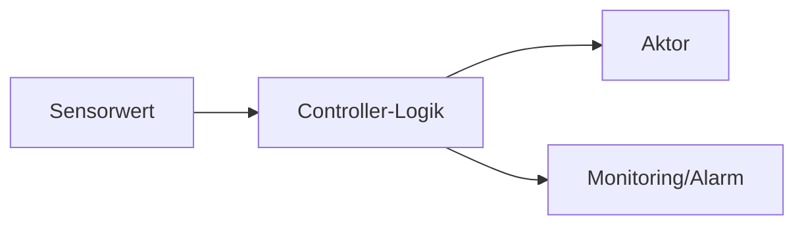

# Cyber-physische Systeme (Sensoren, Aktoren und Bibliotheken)

## Definition
Cyber-physische Systeme (CPS) verbinden Software mit physischer Welt: Sensoren messen, Software entscheidet, Aktoren handeln.

## Warum ist das so?
Viele reale Prozesse (Temperatur, Druck, Position) müssen digital überwacht und geregelt werden.

## Zusammenspiel
Sensor -> Verarbeitung/Regelung -> Aktor.
Bibliotheken liefern Treiber/Funktionen für Hardwarezugriff.

## Eigene Worte
„CPS sind Programme, die nicht nur Daten anzeigen, sondern die reale Welt beeinflussen.“

## Beispielaufgabe
**Aufgabe:** Lüfter soll bei > 70°C auf 100% laufen, sonst 40%.

**Lösung:**
- `if temp > 70 then pwm=100 else pwm=40`
- Erweiterung: Hysterese, damit Lüfter nicht sekündlich springt.
